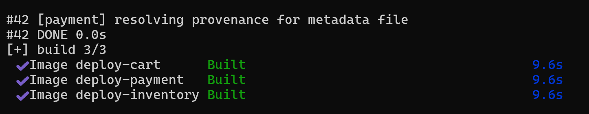
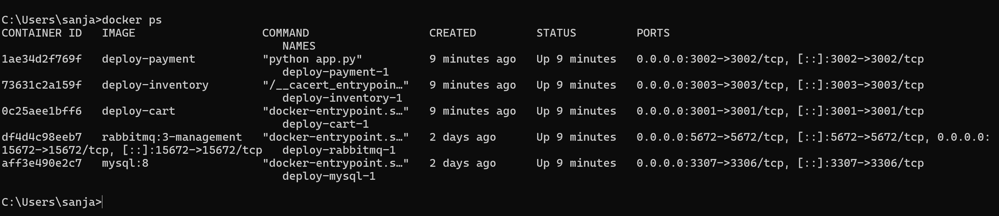
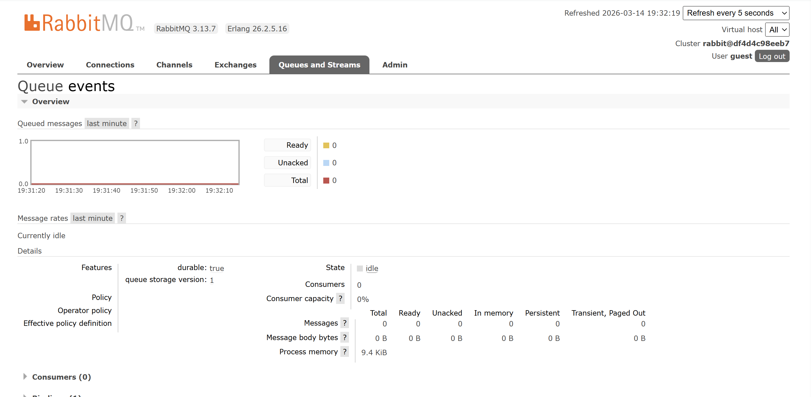
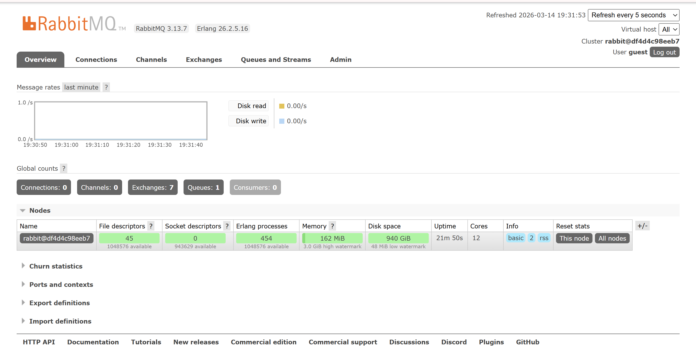
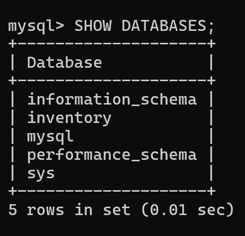
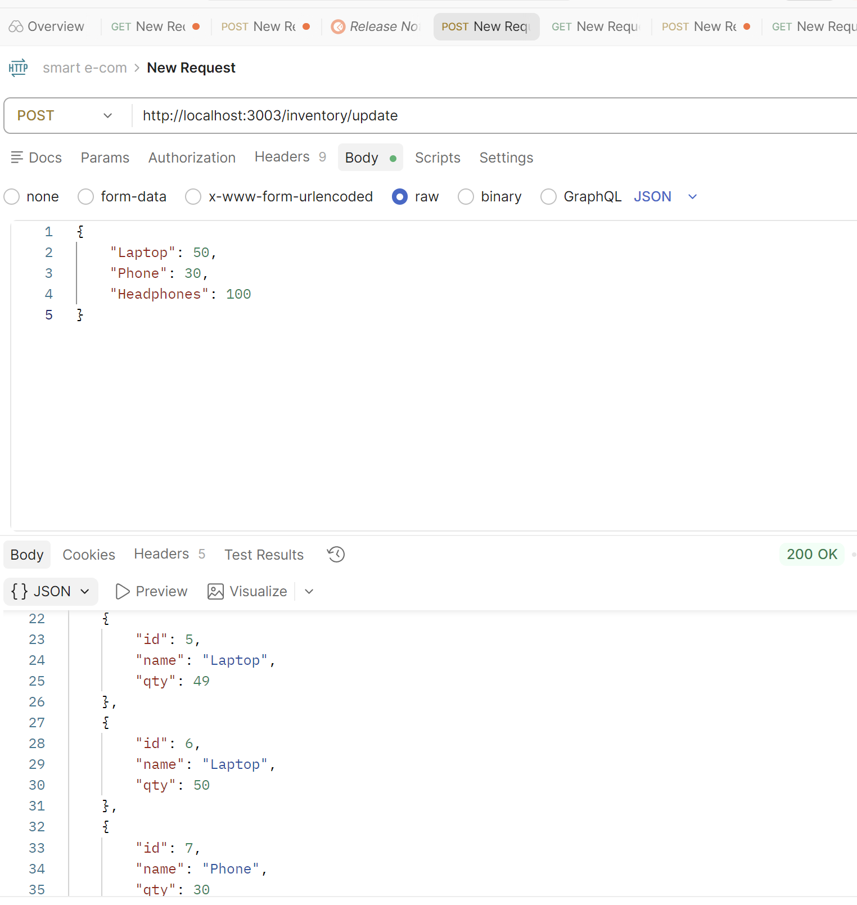
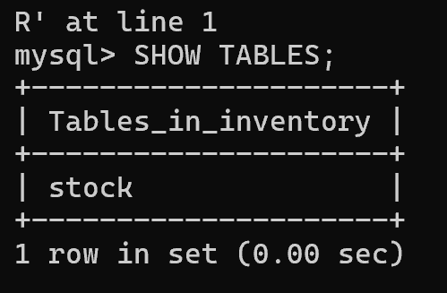
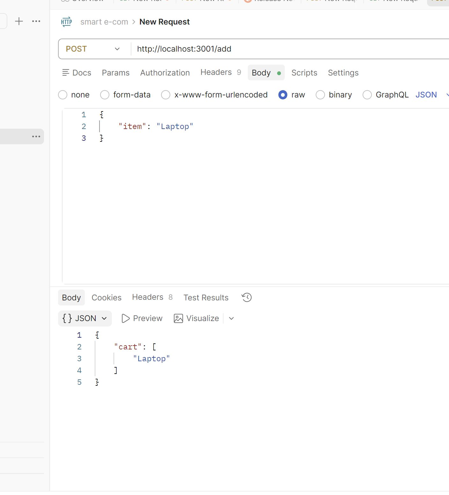
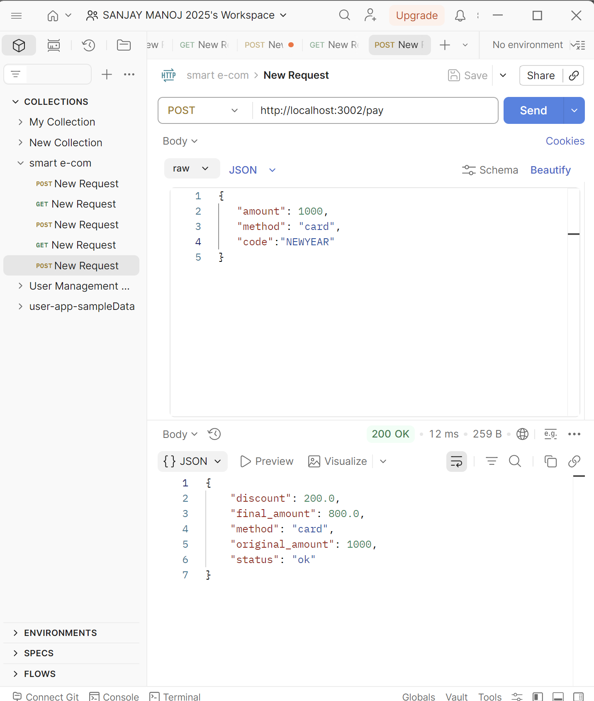
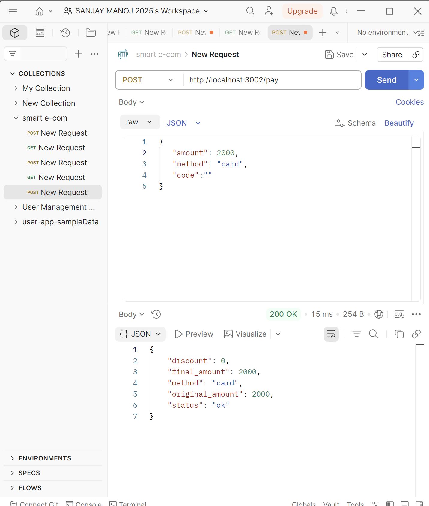

# Smart E-Commerce Microservices System

A cloud-native e-commerce application built using microservices architecture, demonstrating end-to-end checkout pipeline with REST APIs, asynchronous messaging, serverless functions, and containerized deployment.

---

## Table of Contents

- [Architecture Overview](#architecture-overview)
- [Tech Stack](#tech-stack)
- [Services](#services)
- [Prerequisites](#prerequisites)
- [Project Structure](#project-structure)
- [Setup and Installation](#setup-and-installation)
- [Running the Application](#running-the-application)
- [API Endpoints](#api-endpoints)
- [Checkout Flow](#checkout-flow)
- [RabbitMQ Messaging](#rabbitmq-messaging)
- [MySQL Database](#mysql-database)
- [Serverless Discount Function](#serverless-discount-function)
- [gRPC Service](#grpc-service)
- [Kubernetes Deployment](#kubernetes-deployment)
- [Testing with Postman](#testing-with-postman)
- [Screenshots](#screenshots)

---

## Architecture Overview

```
┌─────────────┐     ┌──────────────────┐     ┌─────────────────┐
│ Cart Service│────▶│ Discount Function │────▶│ Payment Service │
│  (Node.js)  │     │   (Serverless)    │     │    (Flask)      │
│  Port: 3001 │     │   Port: 3000      │     │   Port: 3002    │
└─────────────┘     └──────────────────┘     └────────┬────────┘
                                                       │
                                                       │ RabbitMQ
                                                       │ (events queue)
                                                       ▼
                                            ┌─────────────────────┐
                                            │  Inventory Service  │
                                            │   (Spring Boot)     │
                                            │     Port: 3003      │
                                            └──────────┬──────────┘
                                                       │
                                                       ▼
                                                  ┌─────────┐
                                                  │  MySQL  │
                                                  │ Port:   │
                                                  │  3307   │
                                                  └─────────┘
```

**Flow:** Cart → Discount → Payment → RabbitMQ → Inventory → MySQL

---

## Tech Stack

| Technology | Usage |
|------------|-------|
| Node.js + Express | Cart Service |
| Python + Flask | Payment Service |
| Java + Spring Boot | Inventory Service |
| MySQL 8 | Database for inventory |
| RabbitMQ | Asynchronous event messaging |
| Docker + Docker Compose | Containerization |
| Kubernetes | Orchestration |
| Serverless Framework | Discount Function |
| gRPC | Inter-service communication |
| Nginx | Reverse proxy / Load balancer |

---

## Services

| Service | Port | Language | Description |
|---------|------|----------|-------------|
| cart-service | 3001 | Node.js | Add, view, and clear shopping cart |
| payment-service | 3002 | Python/Flask | Process payments, publish RabbitMQ events |
| inventory-service | 3003 | Java/Spring Boot | Manage stock, connected to MySQL |
| discount-function | 3000 | Node.js | Serverless discount code handler |
| rabbitmq | 5672 / 15672 | - | Message broker for async communication |
| mysql | 3307 | - | Persistent database for inventory |

---

## Prerequisites

Make sure the following are installed:

- [Docker Desktop](https://www.docker.com/products/docker-desktop/)
- [Node.js](https://nodejs.org/) (v18+)
- [Python](https://www.python.org/) (v3.11+)
- [Postman](https://www.postman.com/)
- [kubectl](https://kubernetes.io/docs/tasks/tools/) (for Kubernetes)

---

## Project Structure

```
smart-ecom/
├── cart-service/
│   ├── index.js              # Cart REST API (Node.js)
│   ├── Dockerfile
│   └── package.json
├── payment-service/
│   ├── app.py                # Payment REST API (Flask)
│   ├── notify.py             # RabbitMQ publisher
│   └── Dockerfile
├── inventory-service/
│   ├── src/
│   │   └── main/
│   │       ├── java/com/example/inventory/
│   │       │   ├── InventoryController.java
│   │       │   ├── Stock.java
│   │       │   └── StockRepository.java
│   │       └── resources/
│   │           └── application.properties
│   ├── pom.xml
│   └── Dockerfile
├── discount-function/
│   ├── handler.js            # Serverless discount handler
│   ├── localserver.js        # Local Express wrapper
│   ├── serverless.yml        # AWS Lambda config
│   └── package.json
├── grpc-cart/
│   ├── cart.proto            # gRPC service definition
│   ├── server.js             # gRPC server (Node.js)
│   └── client.py             # gRPC client (Python)
├── deploy/
│   ├── docker-compose.yml    # Docker Compose config
│   ├── k8s-cart.yaml         # Kubernetes deployment
│   └── nginx.conf            # Nginx reverse proxy config
└── README.md
```

---

## Setup and Installation

### Step 1 — Clone or extract the project
```bash
cd smart-ecom
```

### Step 2 — Fix RabbitMQ host in Python files (Windows PowerShell)
```powershell
(Get-Content payment-service\notify.py) -replace "ConnectionParameters\('localhost'\)", "ConnectionParameters('rabbitmq')" | Set-Content payment-service\notify.py

(Get-Content inventory-service\consumer.py) -replace "ConnectionParameters\('localhost'\)", "ConnectionParameters('rabbitmq')" | Set-Content inventory-service\consumer.py
```

### Step 3 — Update payment service to publish events
Update `payment-service/app.py` to call `publish_event('payment_processed')` after every payment.

---

## Running the Application

### Start all services with Docker Compose
```bash
cd deploy
docker-compose up --build -d
```

### Verify all containers are running
```bash
docker ps
```

Expected output:
```
deploy-cart-1        Up    0.0.0.0:3001->3001/tcp
deploy-payment-1     Up    0.0.0.0:3002->3002/tcp
deploy-inventory-1   Up    0.0.0.0:3003->3003/tcp
deploy-rabbitmq-1    Up    0.0.0.0:5672, 15672/tcp
deploy-mysql-1       Up    0.0.0.0:3307->3306/tcp
```

### Start Discount Function (separate terminal)
```bash
cd discount-function
npm install
node localserver.js
```

---

## API Endpoints

### Cart Service — `http://localhost:3001`

| Method | Endpoint | Body | Description |
|--------|----------|------|-------------|
| POST | `/add` | `{"item": "Laptop"}` | Add item to cart |
| GET | `/view` | - | View cart contents |
| DELETE | `/clear` | - | Clear cart |

### Payment Service — `http://localhost:3002`

| Method | Endpoint | Body | Description |
|--------|----------|------|-------------|
| POST | `/pay` | `{"amount": 1000, "method": "card", "discount": 0.2}` | Process payment |

### Inventory Service — `http://localhost:3003`

| Method | Endpoint | Body | Description |
|--------|----------|------|-------------|
| POST | `/inventory/update` | `{"Laptop": 50}` | Add/update stock |
| GET | `/inventory/view` | - | View all inventory |

### Discount Function — `http://localhost:3000`

| Method | Endpoint | Body | Description |
|--------|----------|------|-------------|
| POST | `/dev/apply-discount` | `{"code": "NEWYEAR"}` | Apply discount code |

---

## Checkout Flow

Complete end-to-end checkout pipeline — **Cart → Discount → Payment → Inventory**:

### 1. Add item to cart
```json
POST http://localhost:3001/add
{ "item": "Laptop" }
```

### 2. View cart
```json
GET http://localhost:3001/view
```

### 3. Apply discount code
```json
POST http://localhost:3000/dev/apply-discount
{ "code": "NEWYEAR" }
Response: { "discount": 0.2 }
```

### 4. Process payment with discount
```json
POST http://localhost:3002/pay
{
    "amount": 1000,
    "method": "card",
    "discount": 0.2
}
Response: {
    "status": "ok",
    "original_amount": 1000,
    "discount_applied": 0.2,
    "final_amount": 800.0,
    "method": "card"
}
```

### 5. Update inventory after purchase
```json
POST http://localhost:3003/inventory/update
{ "Laptop": 49 }
```

### 6. Verify inventory
```json
GET http://localhost:3003/inventory/view
```

---

## RabbitMQ Messaging

Payment service publishes a `payment_processed` event to RabbitMQ after every successful payment.

### Access RabbitMQ Dashboard
```
URL:      http://localhost:15672
Username: guest
Password: guest
```

### View Messages
1. Click **Queues and Streams** tab
2. Click **events** queue
3. Scroll to **Get Messages**
4. Click **Get Message(s)**
5. Message body: `payment_processed`

### Queue Details
| Property | Value |
|----------|-------|
| Queue Name | events |
| Type | Classic |
| Durable | Yes |
| Message | payment_processed |

---

## MySQL Database

### Connect to MySQL
```bash
docker exec -it deploy-mysql-1 mysql -uroot -psecret inventory
```

### Useful Queries
```sql
-- Show all tables
SHOW TABLES;

-- View all stock
SELECT * FROM stock;

-- View table structure
DESCRIBE stock;

-- Exit
EXIT;
```

### Database Configuration
| Property | Value |
|----------|-------|
| Host | mysql (inside Docker) |
| Port | 3306 (internal) / 3307 (host) |
| Database | inventory |
| Username | root |
| Password | secret |

---

## Serverless Discount Function

### Discount Codes
| Code | Discount |
|------|----------|
| NEWYEAR | 20% (0.2) |
| Any other | 0% (0) |

### Run locally
```bash
cd discount-function
node localserver.js
```

### Test
```bash
# With discount
POST http://localhost:3000/dev/apply-discount
{ "code": "NEWYEAR" }
→ { "discount": 0.2 }

# Without discount
POST http://localhost:3000/dev/apply-discount
{ "code": "OTHER" }
→ { "discount": 0 }
```

---

## gRPC Service

### Start gRPC server
```bash
cd grpc-cart
npm install @grpc/grpc-js @grpc/proto-loader
node server.js
```

### Run Python client
```bash
pip install grpcio grpcio-tools
python3 -m grpc_tools.protoc -I. --python_out=. --grpc_python_out=. cart.proto
python3 client.py
```

### Proto Definition
```proto
service CartService {
  rpc ViewCart(Empty) returns (CartItems);
}
```

---

## Kubernetes Deployment

### Apply cart deployment
```bash
kubectl apply -f deploy/k8s-cart.yaml
```

### Check status
```bash
kubectl get deployments
kubectl get services
kubectl get pods
```

### Cart K8s Config
- **Replicas:** 2
- **Image:** cart-service:latest
- **Port:** 3001
- **Service Port:** 80 → 3001

---

## Testing with Postman

Import and run these requests in order:

| # | Method | URL | Purpose |
|---|--------|-----|---------|
| 1 | POST | localhost:3003/inventory/update | Add stock |
| 2 | GET | localhost:3003/inventory/view | View all stock |
| 3 | POST | localhost:3001/add | Add item to cart |
| 4 | GET | localhost:3001/view | View cart |
| 5 | POST | localhost:3000/dev/apply-discount | Apply NEWYEAR discount |
| 6 | POST | localhost:3000/dev/apply-discount | Test without discount |
| 7 | POST | localhost:3002/pay | Payment with discount |
| 8 | POST | localhost:3002/pay | Payment without discount |
| 9 | POST | localhost:3003/inventory/update | Update stock after purchase |
| 10 | GET | localhost:3003/inventory/view | Verify final stock |

---

## Stopping the Application

```bash
# Stop Docker containers
cd deploy
docker-compose down

# Stop Kubernetes
kubectl delete -f deploy/k8s-cart.yaml
```

---

## Screenshots

### Docker Compose (services running)



### Docker Containers (docker ps)



### RabbitMQ Dashboard



### RabbitMQ Queue (events)



### MySQL Database



### Inventory Update



### Inventory Table



### Add to Cart



### Payment - with Discount



### Payment - without Discount


